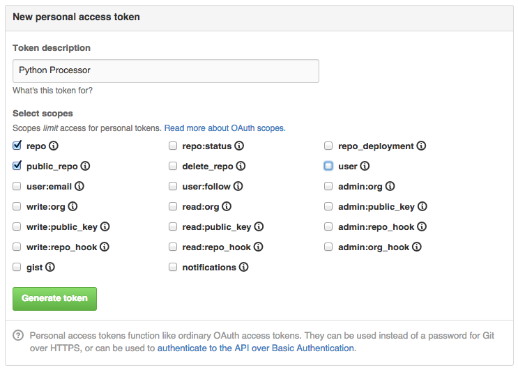

=======
Sources
=======

.. _full list of sources:

mix
====

This is a helper to mix data objects from two or more sources into one stream.
When mixed, dataobjects are interleaved. For example::

  >>> from processor import sources
  >>> source1 = [1,2,3]
  >>> source2 = [5,6,7,8]
  >>> print(list(sources.mix(source1, source2)))
  
  [1, 5, 2, 6, 3, 7, 8]

Mix source iterates through each given source until it raises StopIteration.
That means, if you'll give it an infinite sources like a `web.hook`_, then
resulting source also will be infinite.

imap
====

Imap source is able to read new emails from specified folder on IMAP server.
All you need is to specify server's address, optional port and user credentials:

Example::

  from processor import run_pipeline, source, outputs
  run_pipeline(
      sources.imap("imap.gmail.com",
                            "username",
                            "****word",
                            "Inbox"),
      outputs.debug())

This script will read ``Inbox`` folder at server ``imap.gmail.com``
and print resulting dicts to the terminal's screen.

github
======

Access to private repositories
------------------------------

To have access to private repositories, you need to generate a "personal
access token" at the GitHub.

All you need to do this, is to click `on the image below`_ and it will open a page
with only scopes needed for the Processor:

   
.. _on the image below: https://github.com/settings/tokens/new?scopes=repo,public_repo

Then copy this token into the clipboard and pass it as a ``access_token`` parameter to each
``github.****`` source.

.. Note::
   Access token not only let the processor read from private repositories,
   but also makes rate limits higher, so you could poll GitHub's API more frequently.

   Without token you can make only 60 request per hour, but with token – 5000 requests per hour.

github.releases
---------------

Outputs new releases of the given repository. On first call, it will output all the most recent
releases, then remeber position on next calls will return only new releases if any were found.

Example::

  from processor import run_pipeline, source, outputs
  
  github_creds = dict(access_token='keep-it-in-secret')
  run_pipeline(
      sources.github.releases('https://github.com/mozilla/metrics-graphics', **github_creds),
      outputs.debug())

This source returns following fields:

source
    github.releases
type
    github.release
payload
    The object returned by GitHub's API. See section "Response" at GitHub's docs on `repos/releases`_.

.. _repos/releases: https://developer.github.com/v3/repos/releases/#response

      
twitter
=======

.. Note::
   To use this source, you need to obtain an access token from twitter.
   There is a detailed instruction how to do this `Twitter's documentation`_.
   You could encapsulate twitter credentials into a dict::

      twitter_creds = dict(consumer_key='***', consumer_secret='***',
                           access_token='***', access_secret='***')
      sources.twitter.search('Some query', **twitter_creds)
      sources.twitter.followers(**twitter_creds)

.. _Twitter's documentation: https://dev.twitter.com/oauth/overview/application-owner-access-tokens

twitter.search
--------------

This source runs search by given query in Twitter and returns fresh
results::

  from processor import run_pipeline, source, outputs
  run_pipeline(
      sources.twitter.search('iOS release notes', **twitter_creds),
      outputs.debug())

It returns following fields:

source
    twitter.search
type
    twitter.tweet
*other*
    Other fields are same as them returns Twitter API. See section "Example Result" at twitter's docs on `search/tweets`_.

.. _search/tweets: https://dev.twitter.com/rest/reference/get/search/tweets

twitter.followers
-----------------

First invocation returns all who you follows, each next -- only new followers::

  from processor import run_pipeline, source, outputs
  run_pipeline(
      sources.twitter.followers(**twitter_creds),
      outputs.debug())

It returns following fields:

source
    twitter.followers
type
    twitter.user
*other*
    Other fields are same as them returns Twitter API. See section "Example Result" at twitter's docs on `followers/list`_.

.. _followers/list: https://dev.twitter.com/rest/reference/get/followers/list

web.hook
========

This source starts a webserver which listens on a given interface and port.
All GET and POST requests are transformed into the data objects.

Configuration example::
  
  run_pipeline(sources.web.hook(host='0.0.0.0', port=1999),
               outputs.debug())

By default, it starts on ``localhost:8000``, but in this case on
``0.0.0.0:1999``.

Here is example of data objects, produced by this source when somebody
posts JSON::

  {'data': {'some-value': 0},
   'headers': {'Accept': 'application/json',
     'Accept-Encoding': 'gzip, deflate',
     'Connection': 'keep-alive',
     'Content-Length': '17',
     'Content-Type': 'application/json; charset=utf-8',
     'Host': '127.0.0.1:1999',
     'User-Agent': 'HTTPie/0.8.0'},
   'method': 'POST',
   'path': '/the-hook',
   'query': {'query': ['var']},
   'source': 'web.hook',
   'type': 'http-request'}

This source returns data objects with following fields:

source
    web.hook
type
    http-request
method
    GET or POST
path
    Resource path without query arguments
query
    Query arguments
headers
    A headers dictionary. Please, note, this is usual dictionary with case sensitive keys.
data
    Request data, if this was a POST, None for GET. If requests has ``application/json`` content type, then
    data decoded automatically into the python representation. For other content types, if there is
    charset part, then data is decoded from bytes into a string, otherwise, it remains as bytes.

.. Note::
   This source runs in blocking mode. This means it blocks ``run_pipeline`` execution until somebody interupt it.

   No other sources could be processed together with ``web.hook``.
